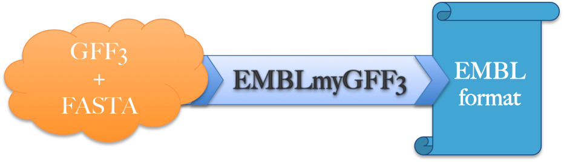

GFF3 to EMBL conversion tool
==============================

Software to convert GFF3 and fasta to legal [EMBL format](https://www.ebi.ac.uk/ena/submit/flat-file) suitable for [ENA](http://www.ebi.ac.uk/ena) submission.

Based on documentation from http://www.insdc.org/files/feature_table.html, http://www.ebi.ac.uk/ena/WebFeat/ and
ftp://ftp.ebi.ac.uk/pub/databases/embl/doc/usrman.txt.

__You don't know how to submit to ENA ? Please visit the [ENA: Guidelines and Tips](http://ena-docs.readthedocs.io/en/latest/)__

## INDEX

[Prerequisite](#prerequisite) 
[Installation](#installation) 
&nbsp;&nbsp;&nbsp;[Installation with pip](#installation-with-pip) 
&nbsp;&nbsp;&nbsp;[Installation with git](#installation-with-git) 
&nbsp;&nbsp;&nbsp;[Check installation](#check-installation) 
[Update](#update) 
&nbsp;&nbsp;&nbsp;[Update with pip](#update-with-pip) 
&nbsp;&nbsp;&nbsp;[Update with git](#update-with-git) 
[Uninstall](#uninstall) 
[Usage](#usage) 
&nbsp;&nbsp;&nbsp;[Foreword](#foreword) 
&nbsp;&nbsp;&nbsp;[Use a provided example](#use-provided-examples) 
&nbsp;&nbsp;&nbsp;[Simple case](#simple-case) 
&nbsp;&nbsp;&nbsp;[Complete case](#complete-case) 
&nbsp;&nbsp;&nbsp;[Advanced case 1](#advanced-case-1) 
&nbsp;&nbsp;&nbsp;[Advanced case 2](#advanced-case-2) 
&nbsp;&nbsp;&nbsp;[Use through a script](#use-through-a-bash-script) 
[Parameter](#parameter) 
[Mapping](#mapping) 
&nbsp;&nbsp;&nbsp;[Feature type](#feature-type) 
&nbsp;&nbsp;&nbsp;[GFF3 Attribute to EMBL qualifier](#gff3-attribute-to-embl-qualifier) 
&nbsp;&nbsp;&nbsp;[Other](#other) 
[Validate your embl flat file](#validate-your-embl-flat-file) 
[Known issues](#known-issues) 
[Citation](#citation)
[Author](#author)

## PREREQUISITE

**Python 2.7**, **biopython 1.67** and the **bcbio-gff 0.6.4** python packages.

In order to install pip please use the following steps:

**Mac OS X / LINUX:**

 Intall pip the python package manager:
 >sudo easy_install pip

 biopython and bcbio-gff will be installed automatically with the next steps

## Installation

#### Installation with pip:
>pip install git+https://github.com/NBISweden/EMBLmyGFF3.git

or if you do not have administartive rights on your machine

>pip install --user git+https://github.com/NBISweden/EMBLmyGFF3.git

#### Installation with git:

Clone the repository:

 >git clone https://github.com/NBISweden/EMBLmyGFF3.git

Move into the folder and install:
 >cd EMBLmyGFF3/
 >python setup.py install

 #### Check installation
 
 Executing:
 >EMBLmyGFF3

 or

 >EMBLmyGFF3 -h

will display some help.

## Update

#### Update with pip:
 
 >pip install git+https://github.com/NBISweden/EMBLmyGFF3.git --upgrade

or if you do not have administartive rights on your machine

 >pip install --user git+https://github.com/NBISweden/EMBLmyGFF3.git --upgrade

#### Update with git:

Move into the repository folder and execute:

 >git pull

## Uninstall

 >pip uninstall EMBLmyGFF3

## USAGE

### FOREWORD

A correct **GFF3 file** and the **genome in FASTA format** that has been used to produce the GFF3 file are the mandatory input files.
Then, in order to get a valid EMBL flat file suitable for submission you have to fill carefully all mandatory metadata.

**/!\ Please be aware that a *project ID* and an *locus tag* are mandatory for a submission to [ENA](http://www.ebi.ac.uk/ena). You don't need this information if you don't plan to submit the data (In case you just want an EMBL-like flat file for other purposes). If you don't have yet those information you can add them later by replacing the corresponding fields. 
To learn how to obtain a *project ID* [click here](http://ena-docs.readthedocs.io/en/latest/mod_02.html.). 
To learn how to obtain a *locus tag* [click here](https://www.ebi.ac.uk/ena/submit/locus-tags).**

### Use provided examples

Three examples are provided with the tool and are located in the ***examples*** folder.
You can try one of the 3 examples by calling **EMBLmyGFF3-maker-example** or **EMBLmyGFF3-augustus-example** or **EMBLmyGFF3-prokka-example** accordingly. This way is convenient when you performed the installation using pip.

  >EMBLmyGFF3-maker-example

If you installed EMBLmyGFF3 using git those example files are located where you have cloned the repository in EMBLmyGFF3/examples/.
You could also access these files by downloading the ***examples*** folder [here.](https://minhaskamal.github.io/DownGit/#/home?url=https://github.com/NBISweden/EMBLmyGFF3/tree/master/examples)
You can then try the examples moving in the examples folder and launching one of the .py or .sh executable like that:

 >python maker_example.py
 
 or
 
 >./maker_example.sh
 
### Simple case

 >EMBLmyGFF3 maker.gff3 maker.fa

Will prompt you to fill one by one the mandatory information needed to produce a proper EMBL file.
Once the software has all the information it needs, it will process the input files and will print the result to STDOUT.

In order to write the result in the desired file use the **-o** option:

 >EMBLmyGFF3 maker.gff3 maker.fa -o result.embl

### Complete case

Minimum requirement to launch the software and avoid any prompt.

 >EMBLmyGFF3 maker.gff3 maker.fa --topology linear --molecule_type 'genomic DNA' --transl_table 1  --species 'Drosophila melanogaster' --locus_tag MY_LOCUS_TAG --project_id PRJXXXXXXX -o result.embl

### Advanced case 1

Adding more information than those mandatory (filling the ID).

 >EMBLmyGFF3 maker.gff3 maker.fa --data_class STD --topology linear --molecule_type "genomic DNA" --transl_table 1  --species 'Drosophila melanogaster' --taxonomy INV --locus_tag LOCUS_TAG --project_id PRJXXXXXXX --rg MYGROUP -o result.embl

### Advanced case 2

Adding more information than those mandatory (filling the ID line + publication and authors information).

 >EMBLmyGFF3 maker.gff3 maker.fa --data_class STD --topology linear --molecule_type "genomic DNA" --transl_table 1  --species 'Drosophila melanogaster' --taxonomy INV --locus_tag LOCUS_TAG --project_id PRJXXXXXXX --rg MYGROUP --author 'author for the reference' --rt 'reference title' --rl 'Some journal' -o result.embl

### Use through a script

You may prefer to launch the software through a script especially when you want to fill many information, so we provide examples of such scripts in bash (.sh) or python (.py) in the **examples** folder.

## PARAMETER

Some parameters are mandatory and some others are not. Here is a list of all parameters available.
You can also find a comprehensive help about the different parameters using the software help command.

**positional arguments:**

| Parameter | Description |
| --- | --- |
|  gff_file|              Input gff-file.|
|  fasta|                 Input fasta sequence.|

**Mandatory Arguments related to the EMBL format to check carrefully:**

| Parameter | Description |
| --- | --- |
|  -i , --locus_tag     | Locus tag prefix registered at ENA. More information [here](https://www.ebi.ac.uk/ena/submit/locus-tags). No default value.|
|  -p , --project_id     |Project ID. The defalut value is 'XXX' *(This option is used to set up the PR line.)*|
|  -r , --transl_table   |Translation table. No default value. *(This option is used to set up the translation table qualifier| transl_table of the CDS features.)* Please visit this [NCBI genetic code](https://www.ncbi.nlm.nih.gov/Taxonomy/Utils/wprintgc.cgi) page for more information.|
|  -s , --species        |Sample Species, formatted as 'Genus species' or taxid. No default value. This option is used to set up the OS line.|
|  -t , --topology       |Sequence topology. No default value. *(This option is used to set up the Topology that is the 3th token of the ID line.)*|
|  -m , --molecule_type  |Molecule type of the sample. No default value.|

**Optional arguments related to the EMBL format:**

| Parameter | Description |
| --- | --- |
|  -a , --accession      |Accession number(s) for the entry. Default value: **XXX** . This option is used to set up the accession number of the AC line and the first token of the ID line as well. **The unique accession number is assigned by the database.** Please visit [this page](https://www.ebi.ac.uk/ena/submit/accession-number-formats) and [this one](https://www.ebi.ac.uk/ena/submit/sequence-submission) to learn more about it.|   
|  -c , --created|        Creation time of the original entry. The default value is the **date of the day**.|
|  -d , --data_class     |Data class of the sample. Default value 'XXX'. *(This option is used to set up the 5th token of the ID line.)*
|  -g , --organelle|      Sample organelle. No default value.|
|  -k , --keyword|        Keywords for the entry. No default value.|
|  -l , --classification| Organism classification. The default value is the classification found in the NCBI taxonomy DB from the species/taxid given as --species parameter. If none is found, 'Life' will be the default value.|
|  -x , --taxonomy       |Source taxonomy. Default value 'XXX'. This option is used to set the taxonomic division within ID line (6th token).|
|  --rc|                  Reference Comment. No default value.|
|  --ra , --author|       Author for the reference. No default value.|
|  --rg                  |Reference Group, the working groups/consortia that produced the record. Default value 'XXX'.|
|  --rl|                  Reference publishing location. No default value.|
|  --rt|                  Reference Title. No default value.|
|  --rx|                  Reference cross-reference. No default value.|
|  --email|               Email used to fetch information from NCBI taxonomy database. Default value 'EMBLmyGFF3@tool.org'.|
|  --interleave_genes|    Print gene features with interleaved mRNA and CDS features.|
|  --keep_duplicates|       Do not remove duplicate features during the process. /!\ Option not suitable for submission purpose.|
|  --force_unknown_features| Force to keep feature types not accepted by EMBL. /!\ Option not suitable for submission purpose.|
|  --force_uncomplete_features| Force to keep features whithout all the mandatory qualifiers. /!\ Option not suitable for submission purpose.|
|  --translate|           Include translation in CDS features. Not activated by default.|
|  --version|             Sequence version number. The default value is **1**.|

**Optional arguments related to the software:**

| Parameter | Description |
| --- | --- |
|  -a, --advanced_help   |Display advanced information of the parameter specified or of all parameters if none specified.|
|  -h, --help            |Show this help message and exit.|
|  -v, --verbose         |Increase verbosity.|
|  -q, --quiet           |Decrease verbosity.|
|  --shame               |Suppress the shameless plug.|
|  -z, --gzip            |Gzip output file.|
|  --uncompressed_log    |Some logs are compressed to ease the reading. With this option they will not be.|
|  -o , --output         |Output filename.|

## MAPPING

The challenge for a correct conversion is the correct mapping between the feature types described in the 3th column as well as the different attribute’s tags of the 9th column of the GFF3 file and the corresponding EMBL features and qualifiers. 
If you figure out that a feature type or an attribute's tag is not mapped to the corresponding EMBL features or qualifiers you would like, you will have to modify the corresponding information in the mapping files. 
The software will skip the unknown feature types (Non EMBL feature types that are not mapped against an EMBL feature type) and the unknown qualifiers (Non EMBL qualifiers that are not mapped against an EMBL qualifier) and will inform you during the conversion process. If you want to include them within the output, you can add the information needed in the corresponding mapping file.

### Feature type

The EMBL format accepts 52 different feature types whereas the GFF3 is constrained to be a Sequence Ontology term or accession number (3th column of the GFF3), but nevertheless this constitutes 2278 terms in version 2.5.3 of the Sequence Ontology.

The file handling the proper mapping is ***translation_gff_feature_to_embl_feature.json***

**example:**

  >"three_prime_UTR": { 
  &nbsp;&nbsp;"target": "3'UTR" 
  }

This will map the **three_prime_UTR** feature type from the 3th column of the GFF3 file to the **3'UTR** EMBL feature type.
**When the feature type from the GFF3 is identical to the EMBL feature no need to specify any target.** If a target is needed and you didn't specified it, the tool will throw a warning message during the process.

You can decide which features will be printed in the output using the **remove** parameter:

  >"exon": { 
  &nbsp;&nbsp;"remove": true 
  }

Like that no exon feature will be display in the output.

### GFF3 Attribute to EMBL qualifier

The embl format accepts 98 different qualifiers where the corresponding attribute tag types in the 9th column of the GFF3 are unlimited.
The file handling the proper mapping is ***translation_gff_attribute_to_embl_qualifier.json***

**example:**

  >"Dbxref": { 
  &nbsp;&nbsp;"source description": "A database cross reference.", 
  &nbsp;&nbsp;"target": "db_xref", 
  &nbsp;&nbsp;"dev comment": "" 
  },

This will map the **Dbxref** attribute's tag from the 9th columm of the GFF3 file to the **db_xref** embl qualifier.

### Other

The **source** (2nd column) as well as the **score** (6th column) from the GFF3 file can also be handled through the ***translation_gff_other_to_embl_qualifier.json*** mapping file.

  >"source": { &nbsp;&nbsp;
  "source description": "The source is a free text qualifier intended to describe the algorithm or operating procedure that generated this
                           feature. Typically this is the name of a piece of software, such as Genescan or a database name, such
                           as Genbank. In effect, the source is used to extend the feature ontology by adding a qualifier to the type
                           creating a new composite type that is a subclass of the type in the type column.",  
  &nbsp;&nbsp;"target": "note", 
  &nbsp;&nbsp;"prefix": "source:", 
  &nbsp;&nbsp;"dev comment": "EMBL qualifiers tend to be more specific than this, so very hard to create a good mapping." 
  },

This will map the **source** from the 2nd columm of the GFF3 file to the **note** embl qualifier.

**/!\\** Please notice the *prefix* allows to add information dowstream the source value wihtin the qualifier (Upstream information is also possible using *suffix*). 
e.g: The source value is "Prokka": 
Within the embl file, instead to get **note="Prokka"**, here we will get **note="source:Prokka"**

## VALIDATE YOUR EMBL FLAT FILE

The output can be validated using the ENA flat file validator distributed by EMBL. Please visit http://www.ebi.ac.uk/ena/software/flat-file-validator and/or https://github.com/enasequence/sequencetools for more information.

## KNOWN ISSUES

**biopython version**
There's a bug between bcbio-gff 0.6.4 and biopython 1.68 though, so use biopython 1.67.

If you have several version of biopython or bcbio-gff on your computer it is possible that an incompatible version is used by default which will lead to an execution error. To check the real version used during the execution you can use this command:

 >python -c "import Bio; from BCBio import GFF; print 'biopython version: '+Bio.\_\_version\_\_; print 'bcbio-gff version: '+GFF.\_\_version\_\_"

**Duplicated Features** 
Features that have the same key (feature type) and location as another feature are considered as duplicates and aren't allowed by the EMBL database. So they are remove during the process. If you don't plan to submit the file to ENA and you wish to keep these features, use the *--keep_duplicates* option.

## CITATION

## AUTHOR

Martin Norling1,2, Niclas Jareborg1,3, Jacques Dainat1,2

1National Bioinformatics Infrastructure Sweden (NBIS), SciLifeLab, Uppsala Biomedicinska Centrum (BMC), Husargatan 3, S-751 23 Uppsala, SWEDEN. 
2IMBIM - Department of Medical Biochemistry and Microbiology, Box 582, S-751 23 Uppsala, SWEDEN. 
3Department of Biochemisty and Biophys-ics, Stockholm University / SciLifeLab, Box 1031, S-171 21 Solna, SWEDEN.
